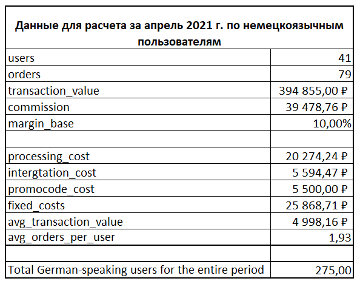
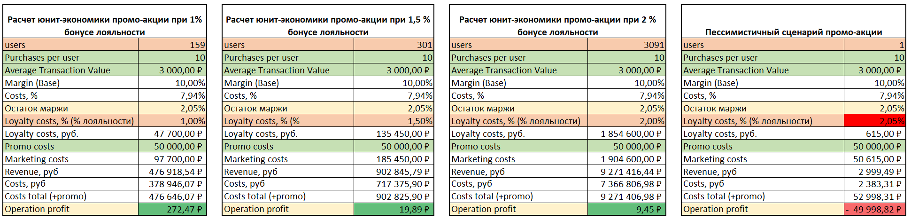
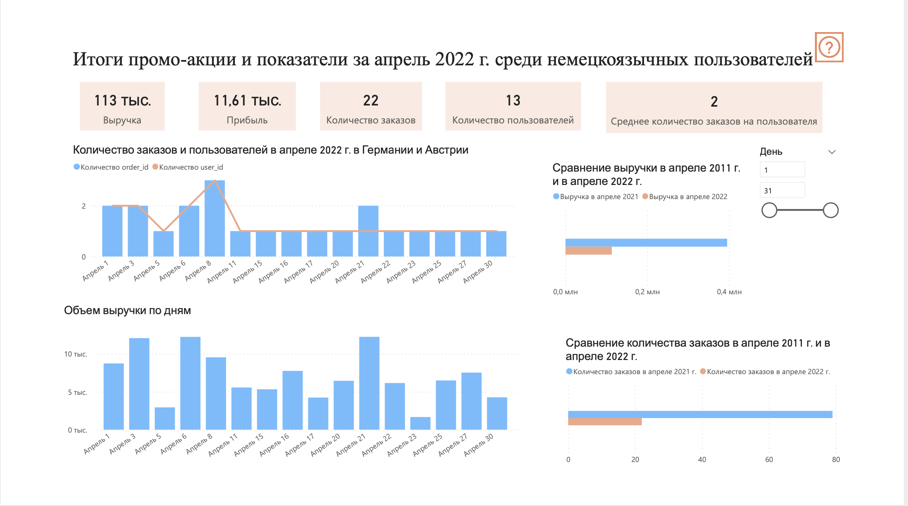
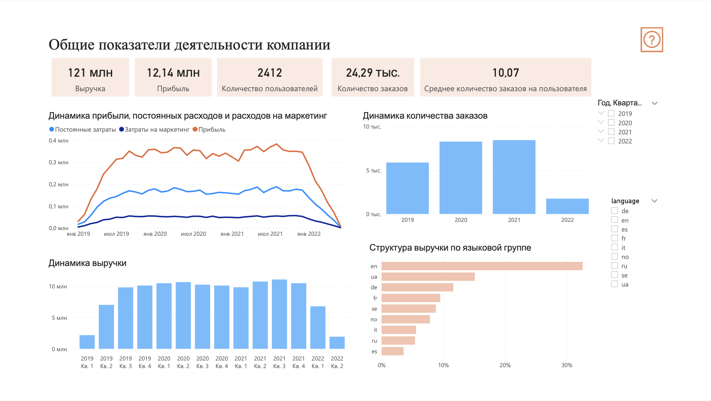
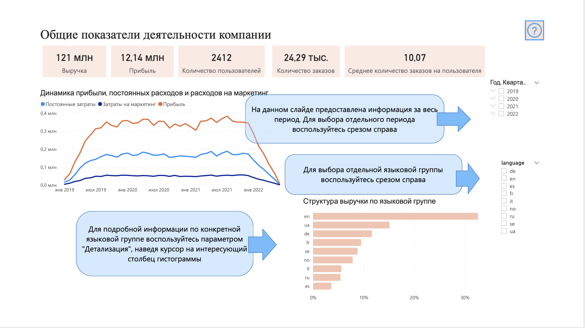
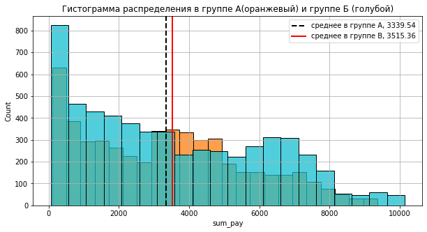
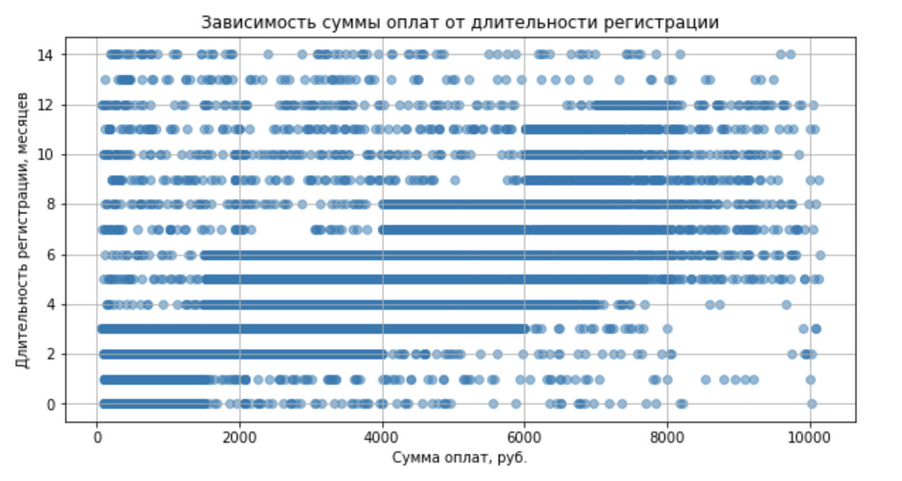
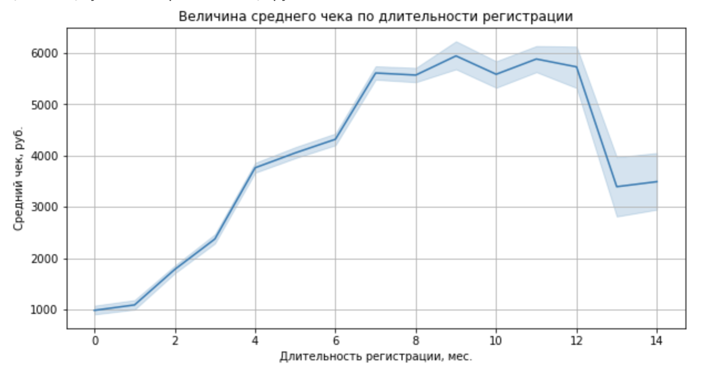

Итоговое работа, она же дипломный проект, представляет собой два независимых исследования. 

# Первая часть - анализ маркетинговой акции

## Условие проекта

В компании СкайТрэвел планируется маркетинговая акция, направленная на вовлечение пользователей, увеличение активности юзеров из Германии и Австрии. Хочется не только нарастить базу активных пользователей, но и увеличить количество покупок, которые приходятся на одного пользователя. Акция будет действовать в апреле 2022 года.

## Суть акции:
Каждый пользователь получает гарантированный приз - баллы лояльности - при достижении 10 покупок в месяц стоимостью больше 3000 рублей.

Случайный участник акции получит главный приз - билеты в Дубай стоимостью в 50 000.

Маркетинг просит посчитать число пользователей, которых мы сможем потенциально охватить этой акцией, а также смоделировать пессимистичные варианты развития событий:

* Какое максимальное число баллов лояльности мы можем дать пользователям на этих рынках при описанных условиях гарантированного приза, оставаясь при этом в рамках прибыльности?
*	Какие максимальные потери мы понесём при таких условиях акции?
* Сколько пользователей следует привлечь, чтобы покрыть все расходы на акцию и получить прибыль?

## Решение:

На первом этапе были выгружены данные из таблиц базы данных с помощью SQL-запроса (PostgreSQL). Эти данные были объединены из 3-х таблиц и отфильтрованы по необходимым параметрам (период и сегмент пользователей).
 
SQL-запрос можно посмотреть в файле `SQL - Диплом_Запрос_1_немцы_2021_выгрузка.sql`.

Также непосредственно в SQL были рассчитаны некоторые показатели: маржинальность, постоянные расходы, средний чек, среднее количество заказов на пользователя.

Посмотреть запрос можно в `SQL - Диплом_Запрос_2_с расчетом.sql`.

Полученные данные были выгружены в excel - `Excel - Расчет.xlsx`. В excel были рассчитаны показатели для оценки маркетинговой акции. На их основании были построены несколько сценариев проведения данной маркетинговой кампании с разными бонусами лояльности. Было посчитано необходимое количество привлеченных пользователей для выхода в прибыль по каждому из сценариев. Рассмотрен пессимистичный сценарий прохождения акции и просчитан убыток от нее.

Для просмотра полученных моделей смотри вкладку «Расчет» в файле `PowerBI - Диплом.pbix`.

Полученные результаты были визуализированы в Power BI. (Смотри файл `PowerBI - Диплом.pdf`)

На вкладке «Промо-акция апрель 2022» наглядно представлены итоги проведения акции. Данные о проведении акции выгружены из той же базы данных, что и расчет, описанный ранее, но учтен непосредственный период проведения этой акции и сегмент потребителей, на который данная акция распространялась. По итогам видно, что поставленный целей промо-акция не достигла (см. Сравнение количества заказов - месяц-к-месяцу за Апрель 2021 и Апрель 2022, оно меньше в 4 раза).

Дополнительно были проанализированы показатели за весь период и по всем пользователям изо всех охваченных стран. (Смотри вкладку «Общие данные» файла `PowerBI - Диплом.pbix`). Здесь с помощью фильтра можно выбрать отдельный период или отдельную языковую группу потребителей и видеть данные только по ним. Если нужны точные цифровые данные, в диаграмме «Структура выручки по языковой группе» можно «провалиться» в детализацию по конкретной группе и получить по ней подробные данные.

Сформированный визуальный отчет дополнен визуальными подсказками для лучшей ориентации в функционале отчета.

Итоговую презентацию задачи можно посмотреть в файле `Презентация диплома.pdf`.

# Вторая часть дипломного проекта – поведение А/Б-тестирования эксперимента рекламной акции. 

## Условие проекта

В компании SkyCrossroads есть рекламная акция, в соответствии с которой клиенту дается возможность получить дополнительные баллы лояльности за покупку, совершенную в течение ограниченного периода времени после запуска акции.

Классическая акция подразумевает получение дополнительные 1000 баллов лояльности за покупку от 100 рублей. Было решено запустить АБ Тест, в котором в тестовой группе предлагается в два раза больше баллов лояльности за покупку от 100 рублей.

Эксперимент был проведен в нескольких торговых точках, которые в датасете представлены столбцом `id_point`. Также в датасете есть информация о том, как долго клиент уже зарегистрирован у нас в программе лояльности.

Отдел маркетинга попросил вас рассчитать результаты этого эксперимента (в целом и в отдельности по каждой точке) и вынести решение об эффективности воздействия Б по сравнению с воздействием А. 

Также проведите сегментацию пользователей с точки зрения из длительности регистрации.

## Решение

Первоначально в среде Python была проведена очистка данных от нулов и выбросов. Рассчитаны основные статистические показатели: средний чек, медианный чек, квартили, децили.

Данные были разделены на две группы: тесовую и контрольную. С помощью библиотек `seaborn` и `matplotlib` были построены гистограммы распределений суммы оплат в каждой̆ группе эксперимента. 

С помощью теста Шапиро определили, нормальны ли наши распределения, с целью узнать, можно ли использовать параметрические методы проверки нулевой гипотезы о равенстве средних. Наши распределения оказались нормальными.

Далее с помощью статистических методов t-критерия Стьюдента и непараметрического теста Манна-Уитни (с помощью библиотеки `scipy.stats`) была проверена гипотеза о равенстве полученных данных в контрольной̆ и тестовой̆ группах. По полученным данным говорить об успешности данного эксперимента. Тестируемые изменения привели к увеличению среднего чека на 5.26 % в тестовой группе по сравнению с контрольной.

Далее был проведен более детальный анализ в разрезе торговых точек компании. Были построены аналогичные визуализации и рассчитаны статистические критерии отдельно по каждой̆ торговой̆ точке компании. Проверена гипотеза о равенстве полученных данных в контрольной̆ и тестовой̆ группах по каждой̆ торговой̆ точке. 
Данный̆ анализ показал, что для достоверной̆ оценки по всем точкам было рассмотрено недостаточное количество продаж. В тех точках, по которым было достаточно наблюдений, результаты оказались разными.  Были сделаны выводы по каждой точке и выдвинуты предположения, почему по некоторым из точек мало данных. 

После этого была оценена корреляция между суммой оплаты и длительностью регистрации. Был рассчитан коэффициент корреляции Спирмена, коэффициент корреляции Пирсона, коэффициент ковариации. Сделаны выводы о взаимозависимости. 

Также была проанализирована зависимость величины среднего чека от длительности регистрации. Сделаны выводы о закономерности и даны рекомендации.

Все расчеты по второй части дипломного проекта можно увидеть в файле: `Python - Диплом.ipynb`.

Презентация по дипломному проекту находится в файле: `Презентация диплома.pdf`.

